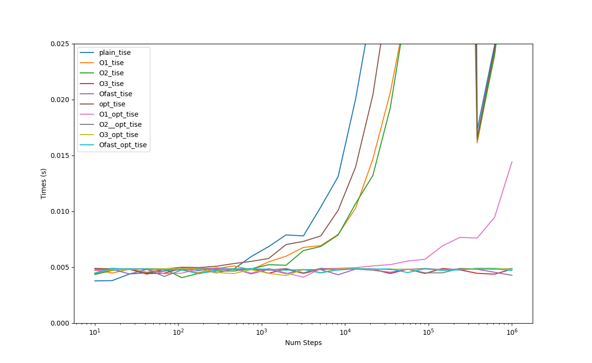

# Project 3: Scientific Computation
## Author: Ben London

---

## Problem: TISE (Time Independent Schrodinger Equation)
### Problem Description: 
The program attempts to solve the Time Independent Schrödinger Equation (TISE) for the first 5 energy levels of a particle in a triangle well. For the purposes of this project, roots are considered known quantities and only the integration of the ODE is computed. 

---

## How to Use:
Run: `./<executable> <steps>`

The choice of steps will change the runtime by cahnging the value of `dx` within the code. `dx` is used to determine the number of computations needed in the integration step. The maximum value of `<steps>` is on the order of 10^6. In the event that the provided value is too large, the program hasundefined behavior. (it will likely seg fault)

To time the different versions a timer script has been provided. Zsh is needed to run it, as it makes use of the `repeat` command. To time a given executable run: `./timer <executable> <steps>`. This will then output the average time of the executable over the course of 1000 runs. Due to the nature of this script, it is not recommended to run it on the python version. 

### C-Specific Instructions:
Provided is a `compile` script which will compile all of the different versions of the code. 

To clean up these executables run the provided `clean` script (NOTE: this will delete all .o files in current directory)

### Python 3:
The package `numpy` is required.

tise.py can be run as an executable with `./tise.py <steps>` and therefore is also a valid executable to be provided to the `timer` script.

---

## Comparison:
NOTE: All timing done on a Rasberry Pi 4

The time it takes to run the original python version (tise.py) with steps = 100000 is ~2.7 seconds. The unoptimized `plain_tise` executable (unoptimized `tise.c`) on the same input runs in ~0.12s. This is around a 22x faster.

Further optimization was done to create `opt_tise.c`. The non-compiler optimized version (`opt_tise`) can run on the same input in ~0.08s. This is a further increase in speed to about 33x faster than the original. 

The best run recorded was on the optimized code copiled with -O3. This `O3_opt_tise` exectuable ran in ~0.0041s. This is approximately 660x faster than the original and 20x faster than the version that was not optimized by the compiler. 

All of the C executables where compared using different step inputs and the results were plotted. (See timer.py for implementation)

Based on the results shown below, it appears that by using the compiler optimizations, we can get significantly better times than any manual optimizations done.

